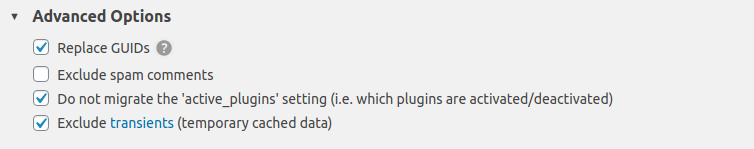
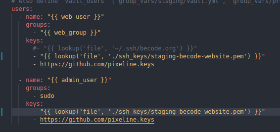

### For migrating the DB on your local PC


#### 1. Remove redirects.conf
After lauching vagrant, to the server 

```
vagrant ssh
```

then, connect with sudo : 

```
sudo -i
```

Go to this folder :

```
cd /etc/nginx/includes.d/all
```

Check the files inside : `ll`

If there is a file `redirects.conf`, remove it : `rm redirects.conf`

Restart nginx :

```
service nginx restart
```

#### 2. becode.test

Go to `http://becode.test` on your web browser. 

If it's the first you connect to becode.test, you must install wordpress. Fill in the form with fakes informations. 


#### 3. Retrieve the DB online on your local PC

connect to http://becode.test/wp-admin > *Check on 1Password for login and password* 

Activate all plugins **WP Migrate DB Pro**. 

> :point_right: *NB : You may need the licence to activate. Check on 1Password, to copy/paste it.*


Then, go to `Tools > Migrate DB Pro > Migrate`

Select `Pull`. You'll need to link with the connexion info of the DB online.

So, connect to http://becode.org/wp-admin and go to `Tools > Migrate DB Pro > Settings` and copy the **Connection info**.

Go back to http://becode.test/wp-admin `Tools > Migrate DB Pro > Migrate` and paste the connection info of the DB in the `Pull` field. 

:warning: Check the **Advanced options**. You mustn't import the plugins settings, so check the box `Do not migrate the active plugins settings`

It should be like that :



The options `Find Replace` should look like that :


> :point_right: Don't select `Media files` option the first time you want to migrate the DB. 

Save your migration profile. 

Click on the button `Pull & Save`. It will take few minutes and it will done. 


#### Possible issue 

If you have this message :


That means you need to change the version of **WP Migrate DB Pro** on your project on local. 

Go to `./site` and open `composer.json`. 

Check for the line `"deliciousbrains-plugin/wp-migrate-db-pro": ...` and change with the correct version. 

After, in your terminal run `composer update`

### Work with staging

Go to the staging branch. 

```git checkout staging```

Go to the trellis folder and run : 

```
./bin/deploy.sh staging becode.org
```

If there is a problem, check the file `trellis/groups_vars/staging/users.yml`. It should look like that : 



## Pour bosser

Pour lancer le staging la première fois `ssh -i staging-becode-website.pub web@staging.becode.org`

1. aller sur la branche staging
2. travaillez en local sur becode.test
3. commit et push
4. déployer en staging

Pour revenir en arrière faire un rollback. 
