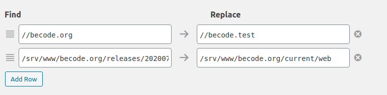
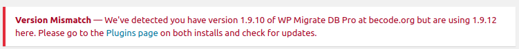

### For migrating the DB on your local PC


#### 1. Remove redirects.conf
After lauching vagrant, to the server 

```
vagrant ssh
```

then, connect with sudo : 

```
sudo -i
```

Go to this folder :

```
cd /etc/nginx/includes.d/all
```

Check the files inside : `ll`

If there is a file `redirects.conf`, remove it : `rm redirects.conf`

Restart nginx :

```
service nginx restart
```

#### 2. Retrieve the DB online on your local PC

connect to http://becode.test/wp-admin

*Check on 1Password for login and password* 

Activate all plugins **WP Migrate DB Pro**. 

*NB : You may need the licence to activate. Check on 1Password, to copy/paste it.*

Go to `Tools > Migrate DB Pro > Migrate`

Select `Pull`. You'll need to link with the connection info of the DB online.

Then, connect to http://becode.org/wp-admin and go to `Tools > Migrate DB Pro > Settings` and copy the connection info.

Go back to http://becode.test/wp-admin `Tools > Migrate DB Pro > Migrate` and paste the connection info of the DB in the Pull field. 

In the options `Find` should look like that :



Select also `Media files` options. 

Save your migration profile. 

Click on the button `Pull & Save`. It will take few minutes and it will done. 

#### Possible problem 

If you have this message :



That means you need to change the version of **WP Migrate DB Pro** on your project on local. 

Go to `./site` and open `composer.json`. 

Check for the line `"deliciousbrains-plugin/wp-migrate-db-pro": ...` and change with the correct version. 

After, in your terminal run `composer update`
